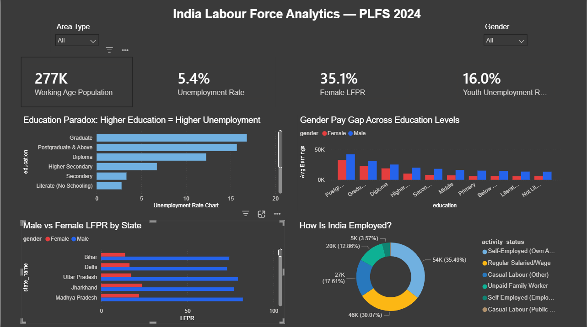
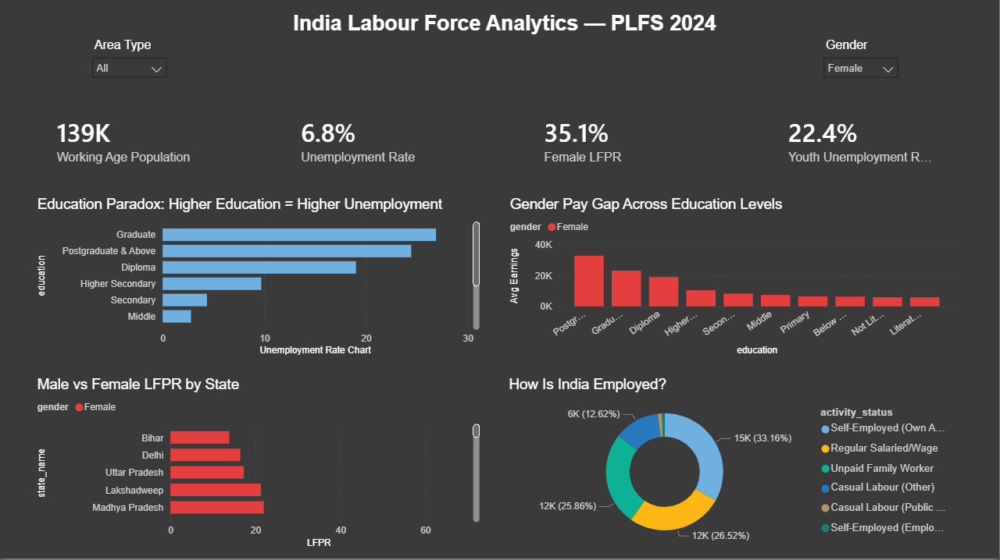
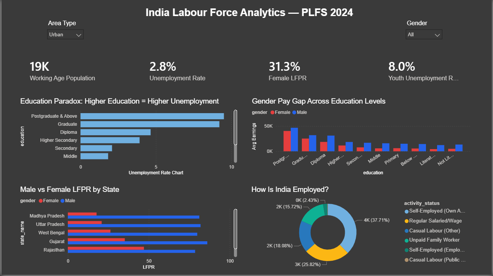

# 🇮🇳 India Labour Force Analytics — PLFS 2024

> Uncovering India's hidden unemployment crisis using official government microdata from the Periodic Labour Force Survey 2024

---

## 📌 Problem Statement

India's headline unemployment rate of **5.4%** looks low — but it hides three deeper crises:
- Educated graduates face **higher unemployment** than those who never finished school
- **65% of working-age women** are completely outside the workforce
- **1 in 5 young people** (15–24) cannot find work

This project analyses 277,485 individual records from India's official PLFS 2024 microdata to uncover these patterns and present actionable findings.

---

## 🔑 Key Findings

| Finding | Insight |
|---------|---------|
| 📚 Education Paradox | Graduates face **16.8% unemployment** vs 0.4% for non-literates |
| 👩 Gender Crisis | Female LFPR is only **35.1%** — Bihar lowest at 13.8% |
| 🧑 Youth Crisis | Youth unemployment is **20.1%** — 3x the national average |
| 💰 Pay Gap | Postgraduate men earn ₹42,540 vs women ₹33,537 — **26% gap** |
| 🏙️ Rural Graduate Crisis | Rural graduates face **17.3% unemployment** vs 9.2% urban |
| 💼 Informal Economy | Only **30.1%** of workers have regular salaried jobs |

---

## 🛠️ Tools & Technologies

| Layer | Tools Used |
|-------|-----------|
| Data Cleaning & EDA | Python, Pandas, NumPy, Plotly |
| SQL Analysis | SQLite, Pandas read_sql |
| Dashboard | Power BI Desktop, DAX |
| Data Source | Ministry of Statistics & Programme Implementation (MOSPI) — PLFS 2024 |

---

## 📁 Project Structure

india-labour-force-analytics/
│
├── EDA.ipynb              ← Python EDA & data cleaning (277K rows)
├── queries.ipynb          ← SQL analysis notebook
├── queries.sql            ← 8 SQL queries with findings
│
├── dashboard_full.png     ← Power BI dashboard — all India view
├── dashboard_urban.png    ← Power BI dashboard — urban filter
├── dashboard_female.png   ← Power BI dashboard — female filter
│
└── README.md

---

## 📊 Dashboard Preview

### Full Dashboard

### Female Filter — Gender Crisis View

### Urban Filter

---

## 📈 EDA Charts

### Education Paradox

### Male vs Female LFPR by State

### Why Are Women Not Working?

### Rural vs Urban Unemployment

---

## 🔍 SQL Queries Summary

8 queries written covering:
1. Unemployment rate by state
2. Unemployment rate by education level
3. LFPR and unemployment by gender and area
4. Unemployment by age group
5. Type of employment distribution
6. Bottom 5 states for female LFPR
7. Gender pay gap across education levels
8. Educated unemployment — rural vs urban breakdown

---

## 💡 Key Recommendations

1. **Target graduate employment** — India's education system produces graduates but the economy isn't absorbing them
2. **Focus on Bihar, Delhi, UP** — female LFPR below 17% needs urgent policy intervention
3. **Create rural formal jobs** — 17.3% of rural graduates are unemployed despite education
4. **Address gender pay gap** — women earn significantly less at every education level

---

## 📂 Data Source

**Periodic Labour Force Survey (PLFS) 2024**
Published by: Ministry of Statistics and Programme Implementation (MOSPI), Government of India
Available at: [data.opencity.in](https://data.opencity.in/dataset/periodic-labour-force-survey-plfs-2024)
License: Open Government Data (OGD) — Public Domain

---

## 👤 Author

**Samarth Behar**
B.Tech Computer Science | IMS Engineering College, Ghaziabad
[LinkedIn](https://linkedin.com/in/samarthbehar) | [GitHub](https://github.com/Samarthbehar)
